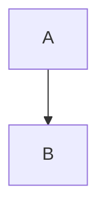

# telegramify-markdown


[](https://badge.fury.io/py/telegramify-markdown)
[](https://pepy.tech/project/telegramify-markdown)

Convert Markdown to Telegram **plain text + [MessageEntity](https://core.telegram.org/bots/api#messageentity)** pairs.

No more MarkdownV2 escaping headaches. This library parses Markdown (including LLM output, GitHub READMEs, etc.) and
produces `(text, entities)` tuples that can be sent directly via the Telegram Bot API — no `parse_mode` needed.

- Handles any format or length — long messages are automatically split at newline boundaries.
- Entity offsets are measured in UTF-16 code units, exactly as Telegram requires.
- Supports LaTeX-to-Unicode conversion, expandable block quotes, Mermaid diagram rendering, and more.
- Built on [pyromark](https://github.com/monosans/pyromark) (Rust pulldown-cmark bindings) for speed and correctness.

> [!NOTE]
> v1.0.0 is a breaking change from 0.x. The output is now `(str, list[MessageEntity])` instead of a MarkdownV2 string.
> The old `markdownify()` and `standardize()` functions have been removed.
>
> **Currently in release candidate.** Install with `pip install telegramify-markdown==1.0.0rc2` to try it.
> The default `pip install telegramify-markdown` still installs the stable 0.5.x version.

## For AI Coding Assistants

Copy this block into your AI assistant's context (e.g. `CLAUDE.md`, Cursor Rules, etc.) to get
accurate code generation for telegramify-markdown:

<details>
<summary>Click to expand context block</summary>

```markdown
# telegramify-markdown integration guide

## Install
pip install telegramify-markdown

## API (v1.0.0+) — outputs plain text + MessageEntity, NOT MarkdownV2 strings

### convert() — sync, single message
from telegramify_markdown import convert
text, entities = convert("**bold** and _italic_")
bot.send_message(chat_id, text, entities=[e.to_dict() for e in entities])
# Do NOT set parse_mode — entities replace it entirely.

### telegramify() — async, auto-splits long text, extracts code blocks as files
from telegramify_markdown import telegramify
from telegramify_markdown.content import ContentType
results = await telegramify(md, max_message_length=4090)
for item in results:
    if item.content_type == ContentType.TEXT:
        bot.send_message(chat_id, item.text, entities=[e.to_dict() for e in item.entities])
    elif item.content_type == ContentType.FILE:
        bot.send_document(chat_id, (item.file_name, item.file_data))
    elif item.content_type == ContentType.PHOTO:
        bot.send_photo(chat_id, (item.file_name, item.file_data))

### split_entities() — manual splitting for convert() output
from telegramify_markdown import convert, split_entities
text, entities = convert(long_md)
for chunk_text, chunk_entities in split_entities(text, entities, max_utf16_len=4096):
    bot.send_message(chat_id, chunk_text, entities=[e.to_dict() for e in chunk_entities])

### Configuration
from telegramify_markdown.config import get_runtime_config
cfg = get_runtime_config()
cfg.markdown_symbol.heading_level_1 = "📌"
cfg.cite_expandable = True

## Critical rules
- entities must be passed as list[dict] via [e.to_dict() for e in entities], NEVER as JSON string
- NEVER set parse_mode when sending with entities — they are mutually exclusive
- All entity offsets are UTF-16 code units. Use utf16_len() to measure text length.
- Requires Python 3.10+
```

</details>

## Install

```bash
pip install telegramify-markdown
# Optional: Mermaid diagram rendering
pip install telegramify-markdown[mermaid]
```

Or with PDM:

```bash
pdm add telegramify-markdown
pdm add telegramify-markdown -G mermaid
```

Requires **Python 3.10+**.

## Quick Start

### `convert()` — single message

Convert Markdown to `(text, entities)` and send with any bot library:

```python
from telebot import TeleBot
from telegramify_markdown import convert

bot = TeleBot("YOUR_TOKEN")

md = "**Bold**, _italic_, and `code`."
text, entities = convert(md)

bot.send_message(
    chat_id,
    text,
    entities=[e.to_dict() for e in entities],
)
```

No `parse_mode` parameter — Telegram reads the entities directly.

### `telegramify()` — long messages, code files, diagrams

For LLM output or long documents, `telegramify()` splits text, extracts code blocks as files,
and renders Mermaid diagrams as images:

```python
import asyncio
from telebot import TeleBot
from telegramify_markdown import telegramify
from telegramify_markdown.content import ContentType

bot = TeleBot("YOUR_TOKEN")

md = """
# Report

Here is some analysis with **bold** and _italic_ text.

```python
print("hello world")
```

And a diagram:


"""

async def send():
    results = await telegramify(md, max_message_length=4090)
    for item in results:
        if item.content_type == ContentType.TEXT:
            bot.send_message(
                chat_id,
                item.text,
                entities=[e.to_dict() for e in item.entities],
            )
        elif item.content_type == ContentType.PHOTO:
            bot.send_photo(
                chat_id,
                (item.file_name, item.file_data),
                caption=item.caption_text or None,
                caption_entities=[e.to_dict() for e in item.caption_entities] or None,
            )
        elif item.content_type == ContentType.FILE:
            bot.send_document(
                chat_id,
                (item.file_name, item.file_data),
                caption=item.caption_text or None,
                caption_entities=[e.to_dict() for e in item.caption_entities] or None,
            )

asyncio.run(send())
```

### `split_entities()` — manual splitting

If you use `convert()` but need to split long output yourself:

```python
from telegramify_markdown import convert, split_entities

text, entities = convert(long_markdown)

for chunk_text, chunk_entities in split_entities(text, entities, max_utf16_len=4096):
    bot.send_message(
        chat_id,
        chunk_text,
        entities=[e.to_dict() for e in chunk_entities],
    )
```

## Configuration

Customize heading symbols, link symbols, and expandable citation behavior:

```python
from telegramify_markdown.config import get_runtime_config

cfg = get_runtime_config()
cfg.markdown_symbol.heading_level_1 = "📌"
cfg.markdown_symbol.link = "🔗"
cfg.cite_expandable = True  # Long quotes become expandable_blockquote
```

## API Reference

### `convert(markdown, *, latex_escape=True) -> tuple[str, list[MessageEntity]]`

Synchronous. Converts a Markdown string to plain text and a list of `MessageEntity` objects.

| Parameter | Type | Default | Description |
|-----------|------|---------|-------------|
| `markdown` | `str` | required | Raw Markdown text |
| `latex_escape` | `bool` | `True` | Convert LaTeX `\(...\)` and `\[...\]` to Unicode symbols |

Returns `(text, entities)` where `text` is plain text and `entities` is a list of `MessageEntity`.

### `telegramify(content, *, max_message_length=4096, latex_escape=True) -> list[Text | File | Photo]`

Async. Full pipeline: converts Markdown, splits long messages, extracts code blocks as files,
renders Mermaid diagrams as images.

| Parameter | Type | Default | Description |
|-----------|------|---------|-------------|
| `content` | `str` | required | Raw Markdown text |
| `max_message_length` | `int` | `4096` | Max UTF-16 code units per text message |
| `latex_escape` | `bool` | `True` | Convert LaTeX to Unicode |

Returns an ordered list of `Text`, `File`, or `Photo` objects.

### `split_entities(text, entities, max_utf16_len) -> list[tuple[str, list[MessageEntity]]]`

Split text + entities into chunks within a UTF-16 length limit. Splits at newline boundaries;
entities spanning a split point are clipped into both chunks.

### `MessageEntity`

```python
@dataclasses.dataclass(slots=True)
class MessageEntity:
    type: str           # "bold", "italic", "code", "pre", "text_link", etc.
    offset: int         # Start position in UTF-16 code units
    length: int         # Length in UTF-16 code units
    url: str | None     # For "text_link" entities
    language: str | None       # For "pre" entities (code block language)
    custom_emoji_id: str | None  # For "custom_emoji" entities

    def to_dict(self) -> dict: ...
```

### Content Types

| Class | Fields | Description |
|-------|--------|-------------|
| `Text` | `text`, `entities`, `content_trace` | A text message segment |
| `File` | `file_name`, `file_data`, `caption_text`, `caption_entities`, `content_trace` | An extracted code block |
| `Photo` | `file_name`, `file_data`, `caption_text`, `caption_entities`, `content_trace` | A rendered Mermaid diagram |

### `utf16_len(text) -> int`

Returns the length of a string in UTF-16 code units (what Telegram uses for offsets).

## Supported Markdown Features

- [x] Headings (Levels 1-4, rendered as bold with emoji prefix)
- [x] `**Bold**`, `*Italic*`, `~~Strikethrough~~`
- [x] `||Spoiler||`
- [x] `[Links](url)` and ``
- [x] Telegram custom emoji ``
- [x] Inline `code` and fenced code blocks
- [x] Block quotes `>` (with expandable citation support)
- [x] Tables (rendered as monospace `pre` blocks)
- [x] Ordered and unordered lists
- [x] Task lists `- [x]` / `- [ ]`
- [x] Horizontal rules `---`
- [x] LaTeX math `\(...\)` and `\[...\]` (converted to Unicode)
- [x] Mermaid diagrams (rendered as images, requires `[mermaid]` extra)

## Acknowledgement

This library is inspired by [npm:telegramify-markdown](https://www.npmjs.com/package/telegramify-markdown).

LaTeX escape is inspired by [latex2unicode](https://github.com/tomtung/latex2unicode) and @yym68686.

## License

This project is licensed under the MIT License — see the [LICENSE](LICENSE) file for details.
