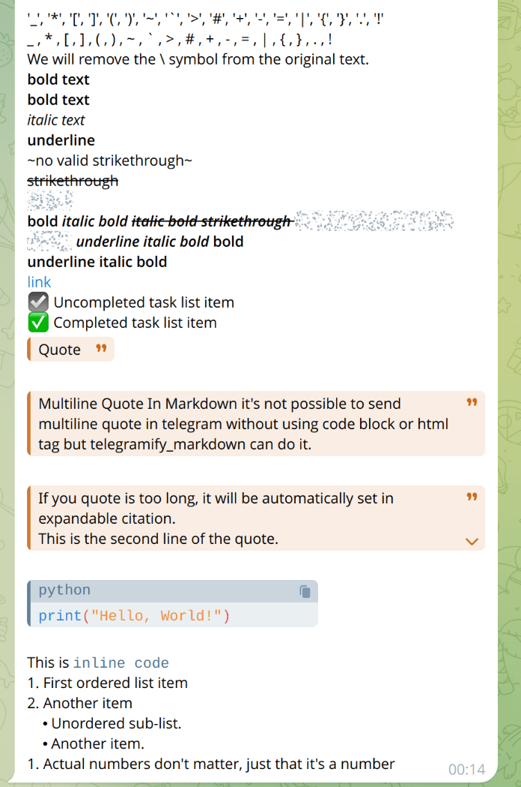

# telegramify-markdown

[](https://badge.fury.io/py/telegramify-markdown)  
[](https://pepy.tech/project/telegramify-markdown)

**Effortlessly Convert Raw Markdown to Telegram's [MarkdownV2](https://core.telegram.org/bots/api#markdownv2-style)
Style**

Say goodbye to formatting issues! You no longer need to write parsers to convert raw Markdown text into Telegram's
MarkdownV2 format.

This library is designed to make reading and sending Markdown content on Telegram easier and more efficient. It is ideal
for LLM responses, GitHub README files, and more.

Forget about formatting errors from the API. Our custom renderer has been tested in a real server environment to ensure
its effectiveness.

> [!NOTE]
> If you're interested, there's also a Node.js version of the library
> available: [npm:telegramify-markdown](https://www.npmjs.com/package/telegramify-markdown).

## Installation

To install the library, run:

```bash
pip install telegramify-markdown
```

or, if you use `pdm`:

```shell
pdm add telegramify-markdown
```

## Supported Input

- [x] Headings (Levels 1-6)
- [x] `Links [text](url)`
- [x] `Images `
- [x] Lists (Ordered and Unordered)
- [x] Tables `|-|-|`
- [x] Horizontal Rules `----`
- [x] Text Styles `*Italic*` and `**Bold**`
- [x] Underline `__Underline__` (if `customize.strict_markdown` is False)
- [x] Code Blocks
- [x] Inline Code
- [x] Block Quotes `>`
- [x] Strikethrough `~~Strikethrough~~`
- [x] Spoilers `||Spoiler||`
- [x] Task Lists
- [x] Expanded Citation
- [ ] Strikethrough `~Strikethrough~`
- [ ] Telegram Emojis
- [ ] Telegram User Mentions

> [!NOTE]
> Despite `~Strikethrough~` being mentioned in Telegram's official documentation, it can't be parsed as strikethrough.

## Use case

````python3
import telegramify_markdown
from telegramify_markdown import customize

customize.markdown_symbol.head_level_1 = "📌"  # If you want, Customizing the head level 1 symbol
customize.markdown_symbol.link = "🔗"  # If you want, Customizing the link symbol
customize.strict_markdown = True  # If you want to use __underline__ as underline, set it to False, or it will be converted to bold.
customize.cite_expandable = True  # If you want to enable expandable citation, set it to True.
markdown_text = """
# Title
## Subtitle
### Subsubtitle
#### Subsubsubtitle
'\_', '\*', '\[', '\]', '\(', '\)', '\~', '\`', '\>', '\#', '\+', '\-', '\=', '\|', '\{', '\}', '\.', '\!'
_ , * , [ , ] , ( , ) , ~ , ` , > , # , + , - , = , | , { , } , . , !
We will remove the \ symbol from the original text.
**bold text**
*bold text*
_italic text_
__underline__
~no valid strikethrough~
~~strikethrough~~
||spoiler||
*bold _italic bold ~~italic bold strikethrough ||italic bold strikethrough spoiler||~~ __underline italic bold___ bold*
__underline italic bold__
[link](https://www.google.com)
- [ ] Uncompleted task list item
- [x] Completed task list item
> Quote

> Multiline Quote In Markdown it's not possible to send multiline quote in telegram without using code block or html tag but telegramify_markdown can do it.

> If you quote is too long, it will be automatically set in expandable citation. 
> This is the second line of the quote.
> This is the third line of the quote.
> This is the fourth line of the quote.
> This is the fifth line of the quote.

```python
print("Hello, World!")
```
This is `inline code`
1. First ordered list item
2. Another item
    - Unordered sub-list.
    - Another item.
1. Actual numbers don't matter, just that it's a number
"""
converted = telegramify_markdown.markdownify(
    markdown_text,
    max_line_length=None,  # If you want to change the max line length for links, images, set it to the desired value.
    normalize_whitespace=False
)
print(converted)
# export Markdown to Telegram MarkdownV2 style.
````

output as follows:

| Exp 1                           | Exp 2                           |
|---------------------------------|---------------------------------|
|  |  |

## Proper Usage

```python
import textwrap

from telebot import TeleBot

import telegramify_markdown
import telegramify_markdown.customize as customize

customize.strict_markdown = False
value1 = 52222
markdown_text = textwrap.dedent(
    f"""
    # Title
    ## Subtitle
    value1: {value1}
    ||spoiler||
    """
)
can_be_sent = telegramify_markdown.markdownify(markdown_text)
TeleBot("TOKEN").send_message(
    "CHAT_ID",
    can_be_sent,
    parse_mode="MarkdownV2"
)
```
