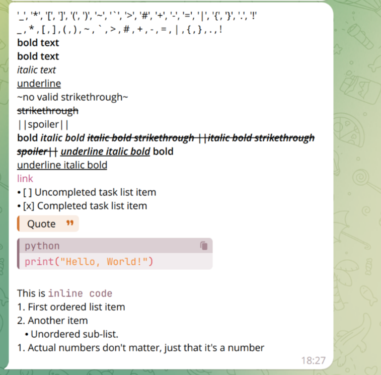

# telegramify-markdown

[](https://badge.fury.io/py/telegramify-markdown)  
[](https://pepy.tech/project/telegramify-markdown)

> 🪄 Python Telegram Markdown Converter | No more formatting headaches.

**Convert Raw Markdown to Telegram's MarkdownV2 Style**

Introducing a robust Python library that enhances Markdown formatting support in Telegram. This library automatically
processes various Markdown inputs, preserving the original formatting without requiring manual escaping. It simplifies
your Markdown interactions on Telegram with seamless auto-processing.

Before this library, sending and rendering unknown Markdown content (like GitHub's README files) required complex
parsing and reconstruction. Now, you can easily handle this and customize it for better results!

Utilizing a custom renderer, the library has been tested in a real server environment to ensure its efficacy.

> For those interested, there is also a Node.js version of the library with the same
> name: [npm:telegramify-markdown](https://www.npmjs.com/package/telegramify-markdown)

## Installation

To install the library, run:

```bash
pip install telegramify-markdown
```

or, if you use `pdm`:

```shell
pdm add telegramify-markdown
```

## Supported Input

- [x] Headings (Levels 1-6)
- [x] `Links [text](url)`
- [x] `Images `
- [x] Lists (Ordered and Unordered)
- [x] Tables `|-|-|`
- [x] Horizontal Rules `----`
- [x] Text Styles `*Italic*` and `**Bold**`
- [x] Underline `__Underline__` (if `customize.strict_markdown` is False)
- [x] Code Blocks
- [x] Inline Code
- [x] Block Quotes `>`
- [x] Strikethrough `~~Strikethrough~~`
- [ ] Task Lists
- [ ] Strikethrough `~Strikethrough~`
- [ ] Spoilers `||Spoiler||`
- [ ] Telegram Emojis
- [ ] Telegram User Mentions

> [!NOTE]  
> Since mistletoe doesn't parse `- [ ] TODO` or Spoilers, we can't implement them.  
> Despite `~Strikethrough~` being mentioned in Telegram's official documentation, it can't be parsed as strikethrough.

## Use case

````python3
import telegramify_markdown
from telegramify_markdown import customize

customize.markdown_symbol.head_level_1 = "📌"  # If you want, Customizing the head level 1 symbol
customize.markdown_symbol.link = "🔗"  # If you want, Customizing the link symbol
customize.strict_markdown = True  # If you want to use __underline__ as underline, set it to False or it will be converted to bold.
markdown_text = """
'\_', '\*', '\[', '\]', '\(', '\)', '\~', '\`', '\>', '\#', '\+', '\-', '\=', '\|', '\{', '\}', '\.', '\!'
_ , * , [ , ] , ( , ) , ~ , ` , > , # , + , - , = , | , { , } , . , !
**bold text**
*bold text*
_italic text_
__underline__
~no valid strikethrough~
~~strikethrough~~
||spoiler||
*bold _italic bold ~~italic bold strikethrough ||italic bold strikethrough spoiler||~~ __underline italic bold___ bold*
__underline italic bold__
[link](https://www.google.com)
- [ ] Uncompleted task list item
- [x] Completed task list item
> Quote
```python
print("Hello, World!")
```
This is `inline code`
1. First ordered list item
2. Another item
    - Unordered sub-list.
1. Actual numbers don't matter, just that it's a number
"""
converted = telegramify_markdown.markdownify(
    markdown_text,
    max_line_length=None,  # If you want to change the max line length for links, images, set it to the desired value.
    normalize_whitespace=False
)
print(converted)
# export Markdown to Telegram MarkdownV2 style.
````

output as follows:


