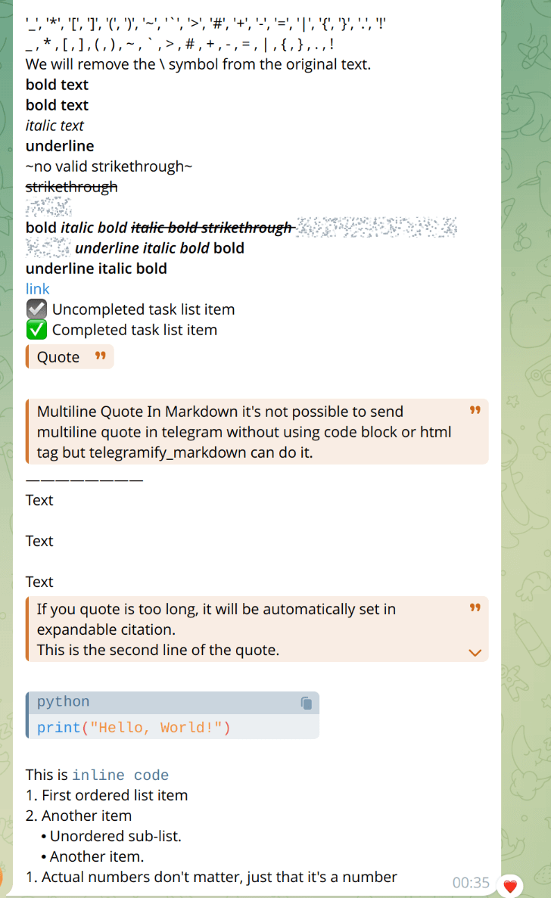
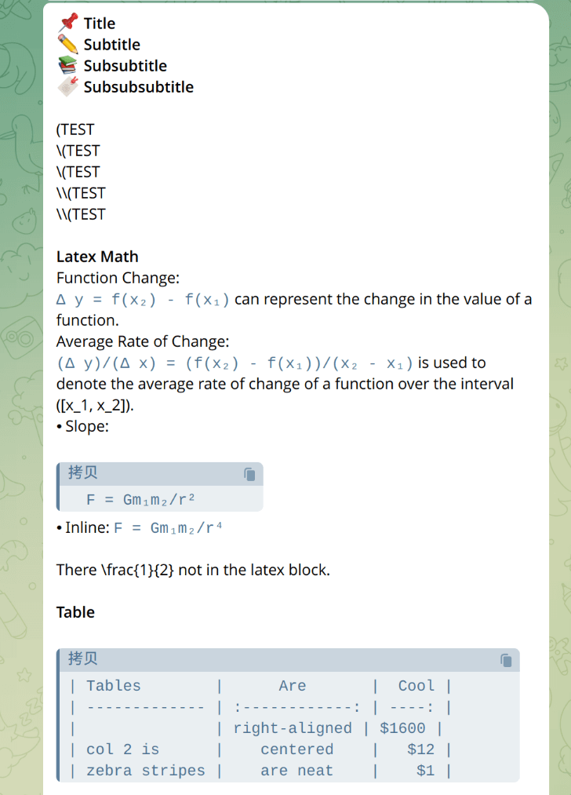
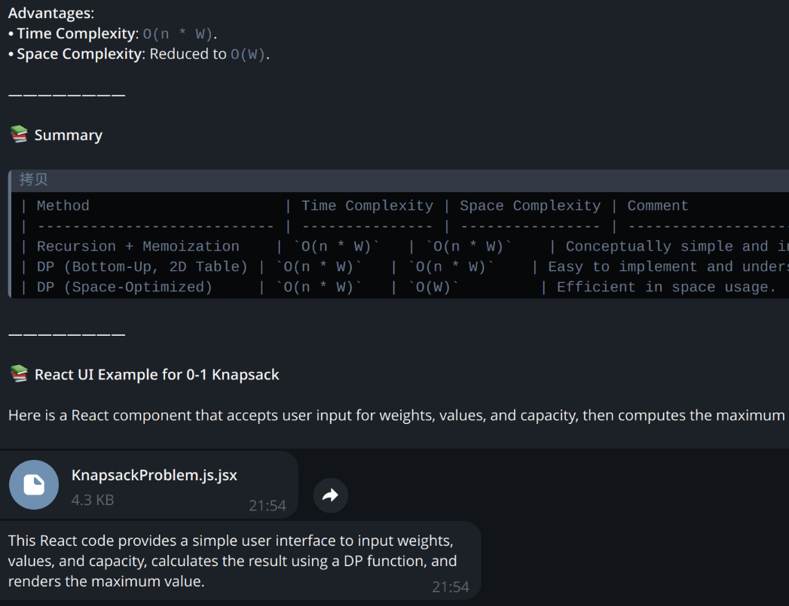

# telegramify-markdown


[](https://badge.fury.io/py/telegramify-markdown)
[](https://pepy.tech/project/telegramify-markdown)

**Effortlessly Convert Raw Markdown to Telegram's [MarkdownV2](https://core.telegram.org/bots/api#markdownv2-style)
Style**

Say goodbye to formatting issues! You no longer need to write parsers to convert raw Markdown text into Telegram's
MarkdownV2 format.

This library is designed to make reading and sending Markdown content on Telegram easier and more efficient. It is ideal
for LLM responses, GitHub README files, and more.

- No matter the format or length, it can be easily handled!
- Forget about formatting errors from the API. Our custom renderer has been tested in a real server environment to
  ensure
  its effectiveness.
- We also support Latex Visualization(escape) and Expanded Citation.
- (telegramify) Mermaid Diagrams render supported.

> [!NOTE]
> If you're interested, there's also a Node.js version of the library
> available: [npm:telegramify-markdown](https://www.npmjs.com/package/telegramify-markdown).

## 🪄 Quick Start

To install the library, run:

```bash
pip install telegramify-markdown
pip install telegramify-markdown[mermaid]
```

or, if you use `pdm`:

```shell
pdm add telegramify-markdown
pdm add telegramify-markdown -G mermaid
# -G mermaid -G tests 
# -> https://pdm-project.org/en/latest/reference/pep621/#optional-dependencies
```

### 🤔 What you want to do?

- If you just want to send *static text* and don't want to worry about formatting,
  check:[playground/markdownify_case.py](https://github.com/sudoskys/telegramify-markdown/blob/main/playground/markdownify_case.py)

- If you are developing an *LLM application* or need to send potentially **super-long text**, please
  check:[playground/telegramify_case.py](https://github.com/sudoskys/telegramify-markdown/blob/main/playground/telegramify_case.py)

- If you want to write TelegramV2 format text directly in bot, please check:[playground/standardize_case.py](https://github.com/sudoskys/telegramify-markdown/blob/main/playground/standardize_case.py)

We have three main functions: `markdownify`, `telegramify`, and `standardize`.

`markdownify`: Just converts raw Markdown text to Telegram's MarkdownV2 format, used for LLM like ChatGPT.

`telegramify`: Spilt long text into multiple chunks, convert format and use Interpreter to render code block to File,
Image etc, used for LLM bot developers who want do more with Telegram's MarkdownV2 format.

`standardize`: Convert unstandardized Telegram's MarkdownV2 format to standardized format(convenient for bot developers write something directly in bot).

> `Interpreter` can be easily customized to inspect the rendering process in `telegramify`.

## 👀 Use case

| markdownify_case 1              | markdownify_case 2              | telegramify_case                |
|---------------------------------|---------------------------------|---------------------------------|
|  |  |  |

### `markdownify`

````python3
import telegramify_markdown
from telegramify_markdown import customize

customize.markdown_symbol.head_level_1 = "📌"  # If you want, Customizing the head level 1 symbol
customize.markdown_symbol.link = "🔗"  # If you want, Customizing the link symbol
customize.strict_markdown = True  # If you want to use __underline__ as underline, set it to False, or it will be converted to bold as telegram does.
customize.cite_expandable = True  # If you want to enable expandable citation, set it to True.

# Use `r` to avoid escaping the backslash.
markdown_text = r""" 
# Title
## Subtitle
### Subsubtitle
#### Subsubsubtitle

\(TEST
\\(TEST
\\\(TEST
\\\\(TEST
\\\\\(TEST

**Latex Math**
Function Change:
    \(\Delta y = f(x_2) - f(x_1)\) can represent the change in the value of a function.
Average Rate of Change:
    \(\frac{\Delta y}{\Delta x} = \frac{f(x_2) - f(x_1)}{x_2 - x_1}\) is used to denote the average rate of change of a function over the interval \([x_1, x_2]\).
- Slope:
   \[
   F = G\frac{{m_1m_2}}{{r^2}}
   \]
- Inline: \(F = G\frac{{m_1m_2}}{{r^4}}\)

There \frac{1}{2} not in the latex block.

**Table**

| Tables        | Are           | Cool  |
| ------------- |:-------------:| -----:|
|               | right-aligned | $1600 |
| col 2 is      | centered      |   $12 |
| zebra stripes | are neat      |    $1 |

'\_', '\*', '\[', '\]', '\(', '\)', '\~', '\`', '\>', '\#', '\+', '\-', '\=', '\|', '\{', '\}', '\.', '\!'
_ , * , [ , ] , ( , ) , ~ , ` , > , # , + , - , = , | , { , } , . , !
We will remove the \ symbol from the original text.
**bold text**
*bold text*
_italic text_
__underline__
~no valid strikethrough~
~~strikethrough~~
||spoiler||
*bold _italic bold ~~italic bold strikethrough ||italic bold strikethrough spoiler||~~ __underline italic bold___ bold*
__underline italic bold__
[link](https://www.google.com)
- [ ] Uncompleted task list item
- [x] Completed task list item
> Quote

>Multiline Quote In Markdown it's not possible to send multiline quote in telegram without using code block or html tag but telegramify_markdown can do it. 
---
Text

Text

Text
> If you quote is too long, it will be automatically set in expandable citation. 
> This is the second line of the quote.
> `This is the third line of the quote.`
> This is the fourth line of the quote.
> `This is the fifth line of the quote.`

"""
converted = telegramify_markdown.markdownify(
    markdown_text,
    max_line_length=None,  # If you want to change the max line length for links, images, set it to the desired value.
    normalize_whitespace=False
)
print(converted)
# export Markdown to Telegram MarkdownV2 style.
````

### `telegramify`

please
check: [playground/telegramify_case.py](https://github.com/sudoskys/telegramify-markdown/blob/main/playground/telegramify_case.py)

### `standardize`

```python
import telegramify_markdown
from telegramify_markdown.customize import get_runtime_config

# Customize symbols (optional)
markdown_symbol = get_runtime_config().markdown_symbol
markdown_symbol.head_level_1 = "📌"  # Customize the first level title symbol
markdown_symbol.link = "🔗"  # Customize the link symbol

# Telegram MarkdownV2 format text
telegram_v2 = r"""
# Title
*bold \*text*
_italic \*text_
__underline__
~strikethrough~
||spoiler||
*bold _italic bold ~italic bold strikethrough ||italic bold strikethrough spoiler||~ __underline italic bold___ bold*

>Block quotation started
>Block quotation continued
>The last line of the block quotation
"""

# Standardize processing
converted = telegramify_markdown.standardize(telegram_v2)

# Send to Telegram
bot.send_message(
    chat_id,
    converted,
    parse_mode="MarkdownV2"  # Must use MarkdownV2 parsing mode
)
```

## 🔨 Supported Input

- [x] Headings (Levels 1-6)
- [x] `Links [text](url)`
- [x] `Images `
- [x] Lists (Ordered and Unordered)
- [x] Tables `|-|-|`
- [x] Horizontal Rules `----`
- [x] Text Styles `*Italic*` and `**Bold**`
- [x] Underline `__Underline__` (if `customize.strict_markdown` is False)
- [x] Code Blocks
- [x] Inline Code
- [x] Block Quotes `>`
- [x] Strikethrough `~~Strikethrough~~`
- [x] Spoilers `||Spoiler||`
- [x] Task Lists
- [x] Expanded Citation
- [x] Telegram Emojis
- [ ] Telegram User Mentions
- [ ] Strikethrough `~Strikethrough~`

> [!NOTE]
> Despite `~Strikethrough~` being mentioned in Telegram's official documentation, it can't be parsed as strikethrough.

## 🔭 Proper Usage

```python
import textwrap

from telebot import TeleBot

import telegramify_markdown
import telegramify_markdown.customize as customize

customize.strict_markdown = False
value1 = 52222
markdown_text = textwrap.dedent(
    f"""
    # Title
    ## Subtitle
    value1: {value1}
    ||spoiler||
    """
)
can_be_sent = telegramify_markdown.markdownify(markdown_text)
TeleBot("TOKEN").send_message(
    "CHAT_ID",
    can_be_sent,
    parse_mode="MarkdownV2"
)
```

## 🧸 Acknowledgement

This library is inspired by [npm:telegramify-markdown](https://www.npmjs.com/package/telegramify-markdown).

latex escape is inspired by [latex2unicode](https://github.com/tomtung/latex2unicode) and @yym68686.

## 📜 License

This project is licensed under the MIT License - see the [LICENSE](LICENSE) file for details.


