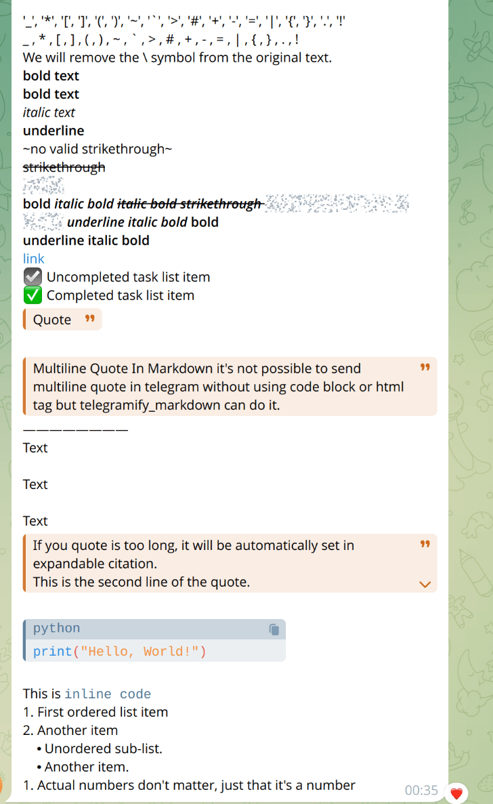
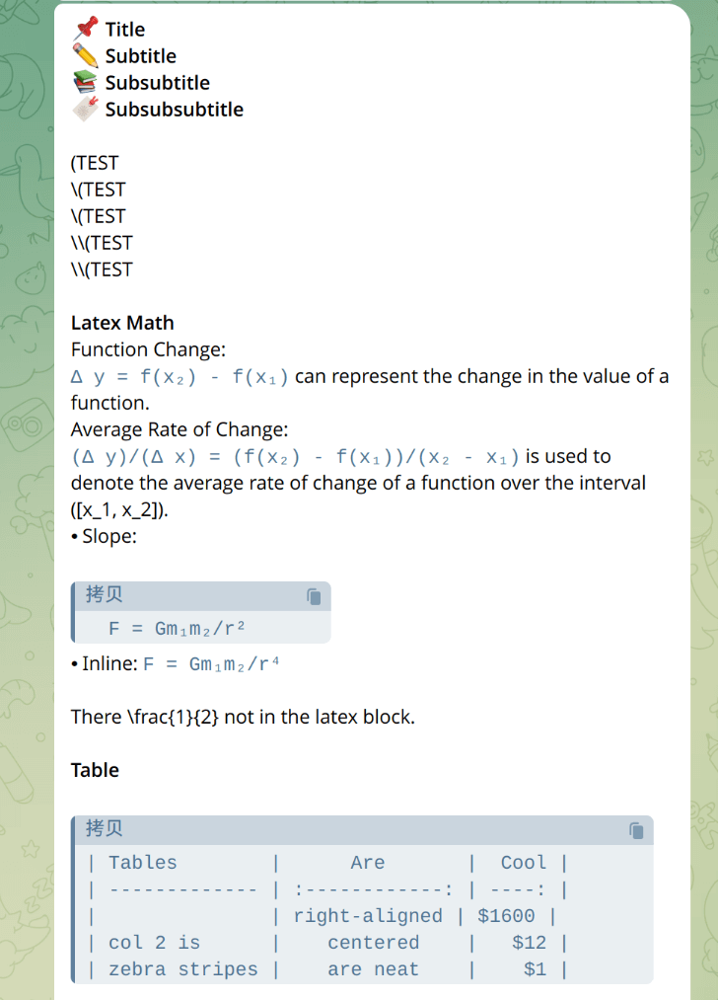
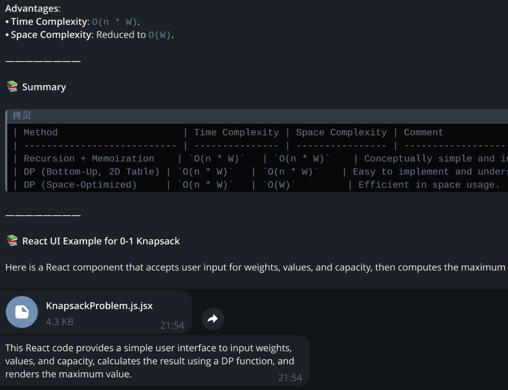

# telegramify-markdown


[](https://badge.fury.io/py/telegramify-markdown)
[](https://pepy.tech/project/telegramify-markdown)

**Effortlessly convert raw Markdown to Telegram plain text +
[MessageEntity](https://core.telegram.org/bots/api#messageentity) pairs.**

Say goodbye to MarkdownV2 escaping headaches! This library parses Markdown (including LLM output, GitHub READMEs, etc.)
and produces `(text, entities)` tuples that can be sent directly via the Telegram Bot API — no `parse_mode` needed.

- No matter the format or length, it can be easily handled!
- Entity offsets are measured in UTF-16 code units, exactly as Telegram requires.
- We also support LaTeX-to-Unicode conversion, expandable block quotes, and Mermaid diagram rendering.
- Built on [pyromark](https://github.com/monosans/pyromark) (Rust pulldown-cmark bindings) for speed and correctness.

> [!NOTE]
> v1.0.0 introduces a new entity-based output: `convert()` returns `(str, list[MessageEntity])`.
> The 0.x functions `markdownify()` and `standardize()` are still available and return MarkdownV2 strings as before.

## 👀 Use case

| convert() | convert() | telegramify() |
|---|---|---|
|  |  |  |

## 🪄 Quick Start

### Install

> Requires **Python 3.10+**.

```bash
# uv (recommended)
uv add telegramify-markdown
uv add "telegramify-markdown[mermaid]"

# pip
pip install telegramify-markdown
pip install "telegramify-markdown[mermaid]"

# PDM
pdm add telegramify-markdown
pdm add "telegramify-markdown[mermaid]"

# Poetry
poetry add telegramify-markdown
poetry add "telegramify-markdown[mermaid]"
```

### 🤔 What you want to do?

- If you just want to send *static text* and don't want to worry about formatting → use **`convert()`**
- If you are developing an *LLM application* or need to send potentially **super-long text** → use **`telegramify()`**
- If you need **streaming output** (token-by-token, like ChatGPT typing) → use **`DraftStream`** (private) or **`EditStream`** (group)
- If you need to split `convert()` output manually → use **`split_entities()`**
- If your middleware only supports `parse_mode="MarkdownV2"` (no `entities` parameter) → use **`markdownify()`**
- If you need to split long MarkdownV2 output safely → use **`split_markdownv2()`**
- If you need finer control over the reverse conversion → use **`entities_to_markdownv2()`**
- If you want Telegram Bot API 10.1 structured Rich Messages → use **`richify()`**
- If you need to split long Rich Messages automatically → use **`telegramify_rich()`**

### `convert()` — single message

```python
from telebot import TeleBot
from telegramify_markdown import convert

bot = TeleBot("YOUR_TOKEN")

md = "**Bold**, _italic_, and `code`."
text, entities = convert(md)

bot.send_message(
    chat_id,
    text,
    entities=[e.to_dict() for e in entities],
)
```

No `parse_mode` parameter — Telegram reads the entities directly.

### `richify()` — Bot API 10.1 Rich Message

For Telegram Bot API 10.1 structured messages, use `richify()` to produce an
`InputRichMessage` payload. This is a parallel output backend: it does not
change `convert()`.

```python
import requests
from telegramify_markdown import richify

md = """
# Report

| Metric | Value |
| --- | --- |
| Speed | **42 ms** |

$$E = mc^2$$
"""

rich_message = richify(md)

requests.post(
    f"https://api.telegram.org/bot{token}/sendRichMessage",
    json={
        "chat_id": chat_id,
        "rich_message": rich_message.to_dict(),
    },
    timeout=30,
)
```

Use `richify(markdown, mode="markdown")` when you want Telegram to parse the
input as Telegram Rich Markdown directly.

### `telegramify_rich()` — long Rich Messages with automatic splitting

For long Markdown that exceeds Telegram's Rich Message limits (32768 bytes or
500 blocks), `telegramify_rich()` splits the output into multiple sendable
chunks:

```python
import requests
from telegramify_markdown import telegramify_rich

md = very_long_markdown  # e.g. LLM output

items = telegramify_rich(md)
for item in items:
    requests.post(
        f"https://api.telegram.org/bot{token}/sendRichMessage",
        json={
            "chat_id": chat_id,
            "rich_message": item.to_dict(),
        },
        timeout=30,
    )
```

Each chunk is a valid, self-contained Rich HTML document. Splitting happens at
block boundaries — never in the middle of a tag or nested structure.

For development changes to Rich Message output, run the live contract test before
opening a PR:

```bash
TELEGRAM_BOT_TOKEN=... TELEGRAM_CHAT_ID=... pdm run test-live-rich
```

The test sends a real `sendRichMessage` request and requires Telegram to return
`Message.rich_message`.

### `DraftStream` / `EditStream` — streaming LLM output (Bot API 9.3+)

For token-by-token LLM output, `DraftStream` sends intermediate drafts via
`sendMessageDraft` / `sendRichMessageDraft`, then finalizes with the complete
message. Works in private chats. For group chats (no draft API), `EditStream`
sends then edits the message.

```python
import asyncio
from telegramify_markdown.stream import DraftStream

async def stream_response(chat_id, token, llm_tokens):
    async def send_draft(payload):
        # Call sendRichMessageDraft with payload.rich_message.to_dict()
        ...

    async def send_final(payload):
        # Call sendRichMessage with payload.rich_message.to_dict()
        ...

    async with DraftStream(
        send_draft=send_draft,
        send_final=send_final,
        mode="rich",           # "rich" | "entity"
        interval=0.3,          # seconds between draft updates
        thinking_delay=0.5,    # show "Thinking..." before first content
        keepalive_timeout=25.0,  # prevent draft expiry
    ) as stream:
        async for tok in llm_tokens:
            stream.feed(tok)
```

For group/channel chats (draft API unavailable):

```python
from telegramify_markdown.stream import EditStream

async with EditStream(
    send_message=my_send_fn,   # async (payload) -> message_id
    edit_message=my_edit_fn,   # async (message_id, payload) -> None
    mode="rich",
    interval=1.0,              # >= 1.0s enforced (Telegram edit rate limit)
) as stream:
    async for tok in llm_tokens:
        stream.feed(tok)
```

### `telegramify()` — long messages, code files, diagrams

For LLM output or long documents, `telegramify()` splits text, extracts code blocks as files,
and renders Mermaid diagrams as images:

````python
import asyncio
from telebot import TeleBot
from telegramify_markdown import telegramify
from telegramify_markdown.content import ContentType

bot = TeleBot("YOUR_TOKEN")

md = """
# Report

Here is some analysis with **bold** and _italic_ text.

```python
print("hello world")
```

And a diagram:


```mermaid
graph TD
    A-->B
```
"""

async def send():
    results = await telegramify(md, max_message_length=4090)
    for item in results:
        if item.content_type == ContentType.TEXT:
            bot.send_message(
                chat_id,
                item.text,
                entities=[e.to_dict() for e in item.entities],
            )
        elif item.content_type == ContentType.PHOTO:
            bot.send_photo(
                chat_id,
                (item.file_name, item.file_data),
                caption=item.caption_text or None,
                caption_entities=[e.to_dict() for e in item.caption_entities] or None,
            )
        elif item.content_type == ContentType.FILE:
            bot.send_document(
                chat_id,
                (item.file_name, item.file_data),
                caption=item.caption_text or None,
                caption_entities=[e.to_dict() for e in item.caption_entities] or None,
            )

asyncio.run(send())
````

### `split_entities()` — manual splitting

If you use `convert()` but need to split long output yourself:

```python
from telegramify_markdown import convert, split_entities

text, entities = convert(long_markdown)

for chunk_text, chunk_entities in split_entities(text, entities, max_utf16_len=4096):
    bot.send_message(
        chat_id,
        chunk_text,
        entities=[e.to_dict() for e in chunk_entities],
    )
```

`split_entities()` omits empty and whitespace-only chunks because Telegram rejects them as empty messages.

### `markdownify()` — direct Markdown to MarkdownV2

If your middleware only supports `parse_mode="MarkdownV2"` and cannot pass entities, use `markdownify()` for a
one-step conversion:

```python
from telegramify_markdown import markdownify

mdv2 = markdownify("**Bold** and `code`")
bot.send_message(chat_id, mdv2, parse_mode="MarkdownV2")
```

`standardize()` is an alias for `markdownify()`, kept for 0.x compatibility.

### `split_markdownv2()` — split MarkdownV2 safely

If your middleware only supports `parse_mode="MarkdownV2"`, split by the rendered MarkdownV2 length, not only by the plain text length:

```python
from telegramify_markdown import convert, split_markdownv2

text, entities = convert(long_markdown)

for mdv2 in split_markdownv2(text, entities, max_utf16_len=4096):
    bot.send_message(chat_id, mdv2, parse_mode="MarkdownV2")
```

### `entities_to_markdownv2()` — reverse conversion to MarkdownV2

If you already have `(text, entities)` from `convert()` and need a MarkdownV2 string:

```python
from telegramify_markdown import convert, entities_to_markdownv2

text, entities = convert("**Bold** and `code`")
mdv2 = entities_to_markdownv2(text, entities)

bot.send_message(chat_id, mdv2, parse_mode="MarkdownV2")
```

This handles all MarkdownV2 escaping rules correctly (different escaping for normal text, code/pre blocks, and URLs).

## ⚙️ Configuration

Customize heading symbols, link symbols, list markers, expandable citation behavior, and Mermaid rendering:

```python
from telegramify_markdown.config import get_runtime_config

cfg = get_runtime_config()
cfg.markdown_symbol.heading_level_1 = "📌"
cfg.markdown_symbol.link = "🔗"
cfg.markdown_symbol.unordered_list_item = "-"   # default "⦁"; try "•", "*", …
cfg.markdown_symbol.ordered_list_suffix = "."   # renders "1. item"; ")" gives "1) item"
cfg.cite_expandable = True  # Long quotes become expandable_blockquote
cfg.mermaid.width = 1280
cfg.mermaid.scale = 2
cfg.mermaid.theme = "default"
cfg.mermaid.image_type = "webp"

# For clean output without emoji heading prefixes:
# cfg.markdown_symbol.heading_level_1 = ""
# cfg.markdown_symbol.heading_level_2 = ""
# cfg.markdown_symbol.heading_level_3 = ""
# cfg.markdown_symbol.heading_level_4 = ""
```

List markers are plain text and carry no entity. Task list items keep using
`task_completed` / `task_uncompleted` and replace the list marker entirely.

`get_runtime_config()` returns a **process-global** config. Setting it once at
startup is the common case. It is shared mutable state, so a bot that varies
symbols per chat must not mutate it inside a handler — concurrent requests would
read each other's values. Use an independent config instead and pass it in:

```python
from telegramify_markdown import RenderConfig, telegramify

cfg = RenderConfig.isolated()          # library defaults, independent
# cfg = get_runtime_config().copy()    # or: start from the current global values
cfg.markdown_symbol.unordered_list_item = "-"

boxes = await telegramify(markdown, config=cfg)
```

`config=` is accepted by `convert()`, `convert_with_segments()`, `markdownify()`,
`standardize()`, and `telegramify()` (which also applies `cfg.mermaid` to
rendered diagrams). `richify()` and `telegramify_rich()` take no config —
Rich HTML emits structural tags and reads no symbols.

See [docs/prd/render-config.md](./docs/prd/render-config.md) for the full contract.

`telegramify()` picks up Mermaid settings from the runtime config. The default Mermaid width is `1000`.

## 📖 API Reference

### `convert(markdown, *, latex_escape=True) -> tuple[str, list[MessageEntity]]`

Synchronous. Converts a Markdown string to plain text and a list of `MessageEntity` objects.

| Parameter | Type | Default | Description |
|-----------|------|---------|-------------|
| `markdown` | `str` | required | Raw Markdown text |
| `latex_escape` | `bool` | `True` | Convert LaTeX `\(...\)` and `\[...\]` to Unicode symbols |

Returns `(text, entities)` where `text` is plain text and `entities` is a list of `MessageEntity`.

### `telegramify(content, *, max_message_length=4096, latex_escape=True) -> list[Text | File | Photo]`

Async. Full pipeline: converts Markdown, splits long messages, extracts code blocks as files,
renders Mermaid diagrams as images.

| Parameter | Type | Default | Description |
|-----------|------|---------|-------------|
| `content` | `str` | required | Raw Markdown text |
| `max_message_length` | `int` | `4096` | Max UTF-16 code units per text message |
| `latex_escape` | `bool` | `True` | Convert LaTeX to Unicode |

Returns an ordered list of `Text`, `File`, or `Photo` objects.

### `split_entities(text, entities, max_utf16_len) -> list[tuple[str, list[MessageEntity]]]`

Split text + entities into chunks within a UTF-16 length limit. Splits at newline boundaries;
entities spanning a split point are clipped into both chunks. Empty and whitespace-only
chunks are omitted because Telegram rejects them as empty messages.

### `markdownify(content, *, latex_escape=True) -> str`

Synchronous. Converts Markdown directly to a Telegram MarkdownV2 string.
Equivalent to `entities_to_markdownv2(*convert(content))`.

| Parameter | Type | Default | Description |
|-----------|------|---------|-------------|
| `content` | `str` | required | Raw Markdown text |
| `latex_escape` | `bool` | `True` | Convert LaTeX to Unicode |

### `standardize(content, *, latex_escape=True) -> str`

Alias for `markdownify()`, kept for 0.x compatibility.

### `richify(markdown, *, mode="html", is_rtl=None, skip_entity_detection=None, latex_escape=False) -> InputRichMessage`

Synchronous. Converts Markdown to a Telegram Bot API 10.1 `InputRichMessage`.

| Parameter | Type | Default | Description |
|-----------|------|---------|-------------|
| `markdown` | `str` | required | Raw Markdown text |
| `mode` | `"html" \| "markdown"` | `"html"` | Generate Telegram Rich HTML, or pass input through as Telegram Rich Markdown |
| `is_rtl` | `bool \| None` | `None` | Optional Bot API `is_rtl` field |
| `skip_entity_detection` | `bool \| None` | `None` | Optional Bot API `skip_entity_detection` field |
| `latex_escape` | `bool` | `False` | In HTML mode, keep raw formula source for Telegram math by default |

`richify()` returns an `InputRichMessage` object with `.to_dict()` for Bot API
payloads. In HTML mode it emits Telegram Rich HTML for paragraphs, headings,
inline formatting, links, lists, block quotes, tables, code blocks, images with
HTTP(S) URLs, custom emoji images, and math tags.

### `telegramify_rich(markdown, *, mode="html", is_rtl=None, skip_entity_detection=None, latex_escape=False) -> list[RichMessage]`

Synchronous. Converts Markdown to a list of sendable Rich Message chunks, each
within Telegram limits (32768 UTF-8 bytes, 500 top-level blocks).

| Parameter | Type | Default | Description |
|-----------|------|---------|-------------|
| `markdown` | `str` | required | Raw Markdown text |
| `mode` | `"html" \| "markdown"` | `"html"` | Rich HTML or Rich Markdown output |
| `is_rtl` | `bool \| None` | `None` | Optional Bot API `is_rtl` field |
| `skip_entity_detection` | `bool \| None` | `None` | Optional Bot API `skip_entity_detection` field |
| `latex_escape` | `bool` | `False` | In HTML mode, keep raw formula source by default |

Returns `list[RichMessage]` where each item has `.to_dict()` for the Bot API.

### `split_rich(rich_message) -> list[InputRichMessage]`

Split a single `InputRichMessage` into multiple chunks within Telegram limits.
Useful when you already have a payload (e.g. from `richify()` on very long input)
and only need splitting.

### `entities_to_markdownv2(text, entities=None) -> str`

Reverse conversion: takes plain text and entities, returns a MarkdownV2 string with correct escaping.
Useful when you already have `(text, entities)` from `convert()` and need a MarkdownV2 string.

| Parameter | Type | Default | Description |
|-----------|------|---------|-------------|
| `text` | `str` | required | Plain text content |
| `entities` | `list[MessageEntity] \| None` | `None` | Entity list (UTF-16 offsets) |

### `split_markdownv2(text, entities=None, max_utf16_len=4096) -> list[str]`

Split text + entities into Telegram MarkdownV2 strings within a rendered UTF-16 length limit.
Use this instead of `split_entities()` when sending with `parse_mode="MarkdownV2"`.

### `MessageEntity`

```python
@dataclasses.dataclass(slots=True)
class MessageEntity:
    type: str           # "bold", "italic", "code", "pre", "text_link", etc.
    offset: int         # Start position in UTF-16 code units
    length: int         # Length in UTF-16 code units
    url: str | None     # For "text_link" entities
    language: str | None       # For "pre" entities (code block language)
    custom_emoji_id: str | None  # For "custom_emoji" entities
    user: dict | None   # For "text_mention" entities
    unix_time: int | None       # For "date_time" entities
    date_time_format: str | None  # For "date_time" entities

    def to_dict(self) -> dict: ...
```

### `InputRichMessage`

```python
@dataclasses.dataclass(slots=True)
class InputRichMessage:
    html: str | None
    markdown: str | None
    is_rtl: bool | None
    skip_entity_detection: bool | None

    def to_dict(self) -> dict: ...
```

### Content Types

| Class | Fields | Description |
|-------|--------|-------------|
| `Text` | `text`, `entities`, `content_trace` | A text message segment |
| `File` | `file_name`, `file_data`, `caption_text`, `caption_entities`, `content_trace` | An extracted code block |
| `Photo` | `file_name`, `file_data`, `caption_text`, `caption_entities`, `content_trace` | A rendered Mermaid diagram |
| `RichMessage` | `rich_message`, `content_trace` | A Rich Message chunk (has `.to_dict()`) |

### `utf16_len(text) -> int`

Returns the length of a string in UTF-16 code units (what Telegram uses for offsets).

## 🔨 Supported Markdown Features

- [x] Headings (Levels 1-6: H1-H2 bold+underline, H3-H4 bold, H5-H6 italic; H1-H4 with emoji prefix)
- [x] `**Bold**`, `*Italic*`, `~~Strikethrough~~`
- [x] `||Spoiler||`
- [x] `[Links](url)` and ``
- [x] Telegram custom emoji ``
- [x] Inline `code` and fenced code blocks
- [x] Block quotes `>` (with expandable citation support)
- [x] Tables (rendered as monospace `pre` blocks)
- [x] Ordered and unordered lists
- [x] Task lists `- [x]` / `- [ ]`
- [x] Horizontal rules `---`
- [x] LaTeX math `\(...\)` and `\[...\]` (converted to Unicode)
- [x] Mermaid diagrams (rendered as images, requires `[mermaid]` extra)
- [x] Telegram Bot API 10.1 Rich Message output via `richify()`

## 🤖 For AI Coding Assistants

This project provides [`llms.txt`](llms.txt) and [`llms-full.txt`](llms-full.txt) for AI assistant context.
Copy the relevant file into your assistant's context (e.g. `CLAUDE.md`, Cursor Rules) for
accurate code generation.

Critical rules:
- Pass entities as `[e.to_dict() for e in entities]` — never as JSON string
- Never set `parse_mode` when sending with entities — they are mutually exclusive
- `richify()` returns `InputRichMessage` for `sendRichMessage`, not text + entities
- Entity offsets are UTF-16 code units. Use `utf16_len()` to measure.

## 🧸 Acknowledgement

This library is inspired by [npm:telegramify-markdown](https://www.npmjs.com/package/telegramify-markdown).

LaTeX escape is inspired by [latex2unicode](https://github.com/tomtung/latex2unicode) and @yym68686.

## 📜 License

This project is licensed under the MIT License — see the [LICENSE](LICENSE) file for details.
